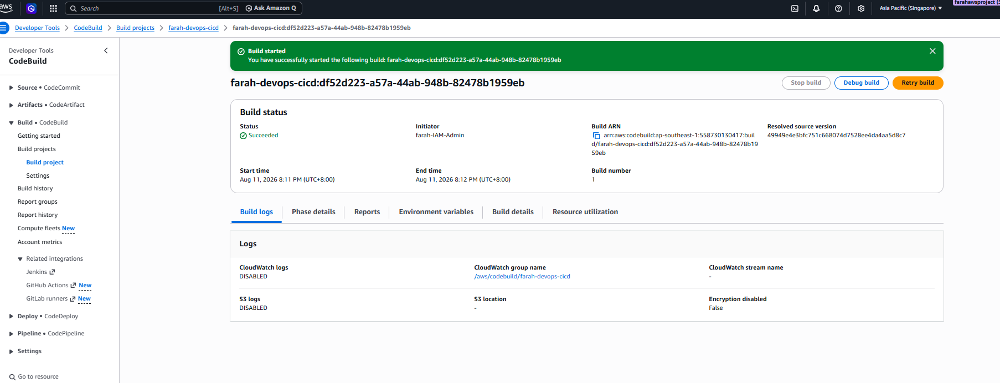
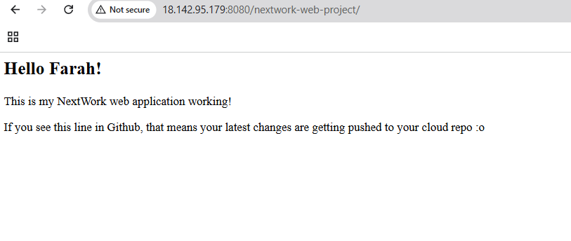
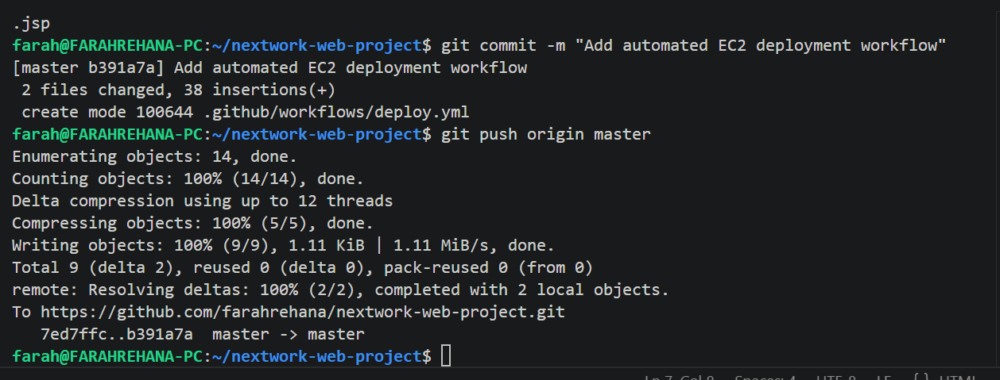
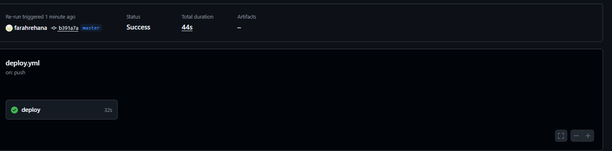
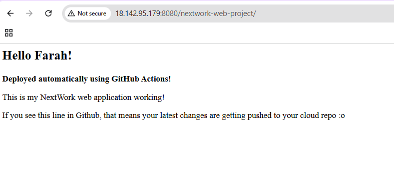

# AWS DevOps CI/CD Web Application

A hands-on DevOps project demonstrating the build and automated deployment of a Java web application using AWS, GitHub, Maven, Apache Tomcat, and GitHub Actions.

This project started with a Java web application hosted on Amazon EC2 and was progressively extended with source control, automated builds, and an automated deployment workflow.

## Project Overview

The goal of this project was to gain practical experience with a basic CI/CD workflow and understand how application code can move from a Git repository to a running cloud environment.

The project demonstrates:

- Hosting a Java web application on Amazon EC2
- Managing source code using Git and GitHub
- Building a Java WAR package using Maven
- Running automated builds with AWS CodeBuild
- Hosting the application using Apache Tomcat 9
- Configuring a GitHub Actions self-hosted runner on EC2
- Automatically deploying application changes after a push to GitHub

## Architecture

```text
Developer (VS Code / WSL)
          |
          | git push
          v
       GitHub
          |
          +--------------------+
          |                    |
          v                    v
   AWS CodeBuild         GitHub Actions
   Build Validation      CI/CD Workflow
                               |
                               v
                    Self-Hosted Runner
                         on AWS EC2
                               |
                               v
                         Maven Build
                               |
                               v
                         WAR Package
                               |
                               v
                        Apache Tomcat 9
                               |
                               v
                     Java Web Application
```

## Technologies Used

- Amazon Web Services (AWS)
- Amazon EC2
- AWS CodeBuild
- IAM
- Git & GitHub
- GitHub Actions
- Linux / WSL
- Java (Amazon Corretto 8)
- Apache Maven
- Apache Tomcat 9
- YAML
- VS Code

## Implementation

### 1. Java Web Application

A Java web application was created using Maven and managed from a Linux development environment through WSL and VS Code.

The application was packaged as a WAR file for deployment to a servlet container.

### 2. Source Control with GitHub

Git was used to track application changes and the project was pushed to GitHub.

Changes to the application could then be committed and pushed to the remote repository as part of the development workflow.

### 3. Continuous Integration with AWS CodeBuild

AWS CodeBuild was configured to retrieve the project source and perform an automated Maven build.

A `buildspec.yml` file defines the build instructions used by CodeBuild.

The successful build confirmed that the application could be built automatically in an AWS-managed build environment.



### 4. EC2 and Apache Tomcat Deployment

An Amazon Linux EC2 instance was configured as the application server.

Apache Tomcat 9 was installed and configured to run the Java web application. The Maven-generated WAR package was deployed to Tomcat and the application was successfully accessed through the EC2 instance.



### 5. Automated Deployment with GitHub Actions

A GitHub Actions workflow was created in:

```text
.github/workflows/deploy.yml
```

A self-hosted GitHub Actions runner was configured on the EC2 instance.

When changes were committed and pushed to the `master` branch, GitHub Actions triggered the deployment workflow.



The workflow:

1. Checks out the latest repository code.
2. Configures the Java build environment.
3. Builds the application using Maven.
4. Generates the WAR package.
5. Stops Apache Tomcat.
6. Replaces the previous application deployment.
7. Starts Tomcat again.
8. Verifies that the Tomcat service is running.

The GitHub Actions deployment completed successfully.



### 6. Final Automated Deployment Test

To verify the CI/CD workflow, the web application was modified and the change was pushed to GitHub.

The GitHub Actions workflow automatically rebuilt and redeployed the application to the EC2 Tomcat server.

The updated message:

> Deployed automatically using GitHub Actions!

confirmed that the latest application version had been successfully deployed.



## CI/CD Workflow

```text
Code Change
    ↓
Git Commit
    ↓
Git Push
    ↓
GitHub
    ↓
GitHub Actions
    ↓
Self-Hosted EC2 Runner
    ↓
Maven Build
    ↓
WAR Package
    ↓
Apache Tomcat
    ↓
Updated Web Application
```

## Key Files

| File | Purpose |
|---|---|
| `pom.xml` | Maven project configuration |
| `buildspec.yml` | AWS CodeBuild build instructions |
| `.github/workflows/deploy.yml` | GitHub Actions deployment workflow |
| `appspec.yml` | Deployment configuration prepared during the deployment phase |
| `scripts/start_tomcat.sh` | Tomcat startup script |
| `scripts/stop_tomcat.sh` | Tomcat shutdown script |
| `src/main/webapp/index.jsp` | Main web application page |

## Challenges and Troubleshooting

Several practical issues were encountered during the project, including:

- Configuring SSH access to EC2
- Correcting Linux private-key permissions
- Configuring EC2 security group rules
- Installing and configuring Apache Tomcat
- Configuring Java and Maven environments
- Resolving Java version and `JAVA_HOME` issues
- Installing the full Amazon Corretto 8 JDK
- Configuring a GitHub Actions self-hosted runner
- Resolving missing runner dependencies on Amazon Linux
- Testing manual deployment before implementing automation

Some AWS developer services were unavailable under the AWS account environment used for this project. Where required, alternative deployment methods were implemented to continue the learning project without overstating the use of unavailable services.

## What I Learned

Through this project, I gained hands-on exposure to:

- Basic AWS cloud infrastructure
- Linux server administration
- Git-based source control
- Java application build processes
- CI/CD concepts
- AWS CodeBuild
- GitHub Actions workflows
- Self-hosted CI/CD runners
- Apache Tomcat deployment
- IAM and basic cloud access management
- Troubleshooting cloud and DevOps environments

## Project Status

**Completed**

The CI/CD workflow was successfully tested by pushing an application change to GitHub and automatically deploying the updated Java web application to Apache Tomcat running on Amazon EC2.

AWS resources used for the lab were removed after completion to avoid unnecessary resource usage.

---

This repository documents a student hands-on learning project created to develop practical understanding of AWS, DevOps, and CI/CD concepts.